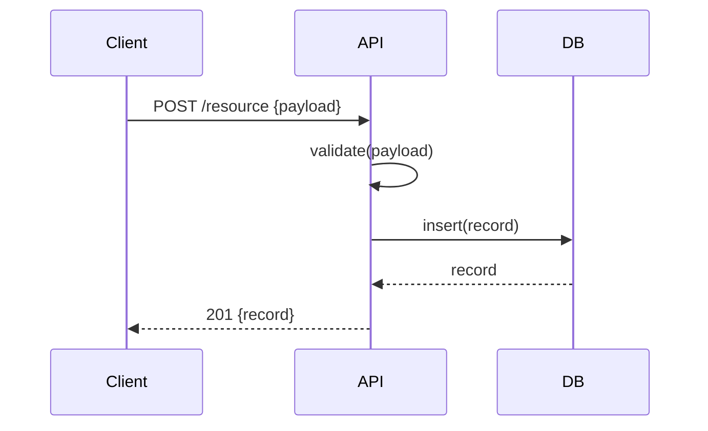

# Spec Generator (Pact-lang Inspired)

Converts natural language requirements or PRDs into structured YAML specifications that are machine-readable and AI-optimized.

---

## The Pipeline

```
/prd (human intent) → /spec (AI-native YAML) → /ralph (executable prd.json)
```

This skill is the middle layer that adds:
- **Effects declarations** (what systems are touched)
- **Structured outputs** (all possible responses)
- **Constraints** (validation rules)
- **Totality requirements** (exhaustive error handling)
- **Latency budgets** (performance SLOs)

---

## Reasoning Process

Before generating the spec YAML, reason through the PRD explicitly. Wrap your reasoning in `<analysis>` tags:

```
<analysis>
1. FEATURE SCOPE
   What is the core feature? What is explicitly out of scope?

2. DOMAIN TYPES
   What data entities are created or modified?
   For each entity: what fields, types, and constraints are required?

3. ENDPOINTS / OPERATIONS
   What actions does the user or system perform?
   For each: method, path, inputs, all possible outputs (success + every error).

4. EFFECT DETECTION
   Which systems does each operation touch?
   (db-write, db-read, email-send, whatsapp-send, github-pr, docker, calendar, api-call, ollama)

5. TOTALITY CHECK
   Which operations are critical paths (auth, payments, data mutations)?
   These get isTotal: true — every error variant MUST be listed in outputs.

6. LATENCY CLASSIFICATION
   API reads → 50-100ms | API writes → 100-500ms | Batch → 1000-5000ms | Heavy → 5000-30000ms

7. TEST COVERAGE
   What test scenarios are implied by the outputs?
   List T-NNN IDs for each endpoint.
</analysis>
```

Only after completing the analysis, generate the YAML spec.

---

## Output Format

Generate a YAML spec file at `tasks/spec-{feature-name}.yaml`:

```yaml
spec: SPEC-{YYYY}-{NNN}
title: "{Feature Title}"
project: {project-name}
branch: ralph/{feature-name-kebab}
specRef: PRD-{feature-name}
author: agent:claude-opus-4

# What systems/APIs does this feature touch?
effects:
  - db-write
  - hub-write
  - whatsapp-send

# Domain types with constraints
types:
  User:
    fields:
      id:
        type: UUID
        generated: true
        immutable: true
      email:
        type: String
        format: email
        unique: true
        constraints:
          - minLen: 5
          - maxLen: 255
      name:
        type: String
        constraints:
          - minLen: 1
          - maxLen: 200

# Endpoints with exhaustive outputs
endpoints:
  createUser:
    method: POST
    path: /api/users
    effects: [db-write]
    isTotal: true
    latencyBudgetMs: 200
    input:
      email:
        type: String
        source: body
        required: true
      name:
        type: String
        source: body
        required: true
    outputs:
      - status: 201
        type: ok
        returns: User
        description: User created successfully
      - status: 400
        type: err
        code: VALIDATION_ERROR
        description: Invalid input data
      - status: 409
        type: err
        code: CONFLICT
        description: Email already exists
      - status: 500
        type: err
        code: INTERNAL_ERROR
        description: Database error

  getUser:
    method: GET
    path: /api/users/{id}
    effects: [db-read]
    isTotal: true
    latencyBudgetMs: 50
    input:
      id:
        type: UUID
        source: path
        required: true
    outputs:
      - status: 200
        type: ok
        returns: User
      - status: 404
        type: err
        code: NOT_FOUND
        description: User not found
      - status: 400
        type: err
        code: INVALID_ID
        description: Invalid UUID format

# Test references
tests:
  - id: T-001
    covers: createUser
    scenario: "Create user with valid data"
  - id: T-002
    covers: createUser
    scenario: "Reject duplicate email"
  - id: T-003
    covers: getUser
    scenario: "Get existing user"
  - id: T-004
    covers: getUser
    scenario: "Handle not found"

# Quality gates
quality:
  - All endpoints must handle errors explicitly
  - All isTotal endpoints must cover all output variants
  - Latency budgets must be defined for all endpoints
```

---

## Conversion Rules

### From PRD to Spec

1. **Feature title** → `title`
2. **Requirements** → `endpoints` with inputs/outputs
3. **Data models** → `types` with constraints
4. **"Must handle errors"** → `isTotal: true`
5. **"Real-time/fast"** → `latencyBudgetMs: 50-100`
6. **"Batch/heavy"** → `latencyBudgetMs: 1000-5000`

### Effect Detection

| Keyword in PRD | Effect |
|----------------|--------|
| "save", "create", "update", "delete" | `db-write` |
| "fetch", "list", "get", "query" | `db-read` |
| "notify", "send message" | `whatsapp-send` |
| "create PR", "push" | `github-pr` |
| "container", "docker" | `docker` |
| "calendar", "schedule" | `calendar` |
| "email", "send email" | `email-send` |

### Constraint Extraction

| PRD phrase | Constraint |
|------------|------------|
| "required" | `required: true` |
| "1-200 characters" | `minLen: 1, maxLen: 200` |
| "email format" | `format: email` |
| "unique" | `unique: true` |
| "auto-generated" | `generated: true` |
| "cannot change" | `immutable: true` |

### Output Mapping

| Scenario | HTTP Status | Error Code |
|----------|-------------|------------|
| Success (create) | 201 | - |
| Success (read) | 200 | - |
| Success (update) | 200 | - |
| Success (delete) | 204 | - |
| Not found | 404 | NOT_FOUND |
| Invalid input | 400 | VALIDATION_ERROR |
| Duplicate | 409 | CONFLICT |
| Unauthorized | 401 | UNAUTHORIZED |
| Forbidden | 403 | FORBIDDEN |
| Rate limited | 429 | RATE_LIMITED |
| Server error | 500 | INTERNAL_ERROR |

---

---

## 3-File Spec Structure (SDLD Pattern)

For larger features, generate three files instead of one — each serves a different audience and phase:

### `tasks/requirements-{feature}.md` (EARS notation)
Machine-readable requirements using EARS (Easy Approach to Requirements Syntax):

```markdown
# Requirements: {Feature Name}

## Functional Requirements
- **EARS-UBIQ-001**: The system SHALL {do X}
- **EARS-EVENT-002**: WHEN {event} the system SHALL {do Y}
- **EARS-COND-003**: WHERE {condition} the system SHALL {do Z}
- **EARS-OPT-004**: WHERE {optional feature} is included the system SHALL {do W}
- **EARS-UNW-005**: IF {unwanted condition} THEN the system SHALL {respond}

## Non-Functional Requirements
- **PERF-001**: {endpoint} SHALL respond within {N}ms at p99
- **SEC-001**: All inputs SHALL be validated against {schema}
- **REL-001**: The system SHALL handle {failure mode} gracefully

## Out of Scope
- {explicitly excluded features}
```

### `tasks/design-{feature}.md` (sequence diagrams + decisions)
Architecture decisions and interaction flows:

````markdown
# Design: {Feature Name}

## Architecture Decision
**Choice:** {chosen approach}
**Rationale:** {why}
**Rejected alternatives:** {what and why not}

## Sequence Diagram



## Data Flow
{describe how data moves through the system}

## Error Handling Strategy
{how failures are surfaced to the caller}
````

### `tasks/tasks-{feature}.md` (execution checklist)
Ordered task list with status tracking — this replaces the need to re-read the full spec mid-sprint:

```markdown
# Tasks: {Feature Name}

## Status: IN PROGRESS

| # | Task | Status | Story |
|---|------|--------|-------|
| 1 | Add DB schema | ✅ Done | US-001 |
| 2 | Implement service | 🔄 Active | US-002 |
| 3 | Wire up route | ⬜ Pending | US-003 |
| 4 | Add frontend component | ⬜ Pending | US-004 |
```

**When to use 3-file vs single YAML:**
- Single YAML (`spec-{feature}.yaml`): small features, 1-3 stories, one developer
- 3-file SDLD: larger features, 4+ stories, multi-layer changes, or when human review is important before coding starts

---

## Automation Hooks

### Auto-trigger after /prd

When a PRD is created, automatically suggest running `/spec`:

```
PRD created: tasks/prd-{feature}.md
→ Suggest: "Run /spec to generate structured YAML spec"
```

### Integration with /ralph

The `/ralph` skill can read the spec file to:
1. Auto-populate effects for each story
2. Set isTotal flags based on spec
3. Generate acceptance criteria from outputs
4. Set latency budgets

### Pre-commit Validation

Add to `.claude/hooks/pre-commit`:
```bash
# Validate spec files
for spec in tasks/spec-*.yaml; do
  claude-code validate-spec "$spec"
done
```

---

## Example Conversion

### Input (from /prd)

```markdown
## Requirements
- User can register with email and password
- Email must be unique
- Password must be 8+ characters
- System sends welcome email after registration
```

### Output (from /spec)

```yaml
spec: SPEC-2026-001
title: "User Registration"
project: my-app
effects:
  - db-write
  - email-send

types:
  User:
    fields:
      email:
        type: String
        format: email
        unique: true
      password:
        type: String
        constraints:
          - minLen: 8

endpoints:
  register:
    method: POST
    path: /api/auth/register
    effects: [db-write, email-send]
    isTotal: true
    latencyBudgetMs: 500
    outputs:
      - status: 201
        type: ok
        returns: User
      - status: 400
        type: err
        code: VALIDATION_ERROR
      - status: 409
        type: err
        code: CONFLICT
        description: Email already registered
```

---

## Checklist Before Saving

- [ ] All endpoints have effects declared
- [ ] All endpoints have outputs for success AND error cases
- [ ] Critical paths have `isTotal: true`
- [ ] Latency budgets are realistic
- [ ] Types have appropriate constraints
- [ ] Test references cover all endpoints
- [ ] Quality gates are defined
